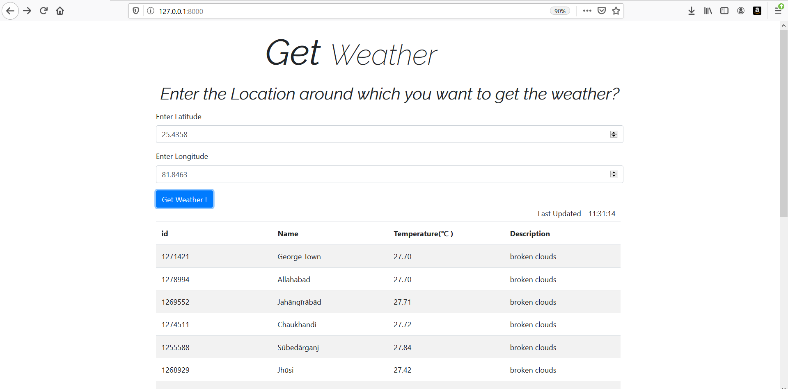

# task_01

**task_01** is a webapp which uses weather API's and displays weather of all cities around any Location .Latitude and Longitude of any Location is to entered and it shows 
weather of a fixed number number of cities around that Location , and the data gets automatically updated after a fixed time . 

